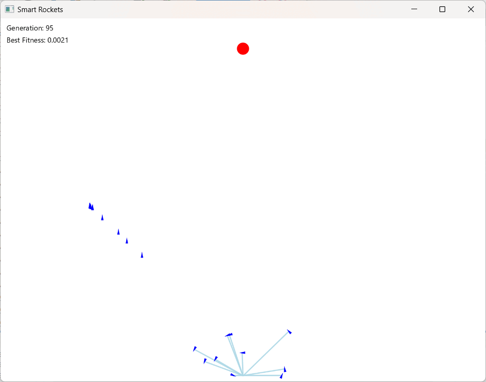

# Rocket Evolution 🚀

## Introduction 🤔

This project uses genetic algorithms to simulate the evolution of rockets over time. The goal is to create a population of rockets that can survive and thrive in a challenging environment.

## Concept 🧬

The project is inspired by the concept of survival of the fittest, which is a key principle of natural selection. By applying genetic algorithms to the design of rockets, we can create a population of rockets that are better suited to their environment and more likely to survive.

### Genetic Algorithm
A genetic algorithm (GA) is a metaheuristic inspired by the process of natural selection that belongs to the larger class of evolutionary algorithms (EA). Genetic algorithms are commonly used to generate high-quality solutions to optimization and search problems by relying on biologically inspired operators such as mutation, crossover and selection.

It is inspired by Charles Darwin's theory of Natural Selection.

<b><i>Survival Of The Fittest.</i></b>
  

### How does it work ?
Here a population of rockets attempt to find a way to the target without crashing. We initially start with a population of rockets that have a DNA with random genes. After the life span of this population we use a fitness function to decide the fitness of each rocket. We then select two rockets as parents based on their fitness score for reproduction.

A crossover point is chosen in DNA of the child and it contains the DNA of first parent before the crossover point and DNA of second parent after crossover point.

After a child is produced by crossover we mutate some of the genes in the DNA. There is a very slight probability for a gene to mutate. Mutations are important to maintain diversity in a populationand to prevent the premature convergence.

This cycle of selection, crossover and mutation goes on and after some time a convergence in the maximum fitness of the population is achieved beyond which the fitness cannot increase. Then the offsprings produced are not significantly different from the previous generation. We then say that a set of solution to our problem is achieved by the genetic algorithm.

## Features 🚀

* Genetic algorithm for simulating the evolution of rockets
* Natural selection for survival of the fittest
* Rockets can evolve over time to adapt to their environment
* User interface for controlling the simulation

## Requirements 📝

* Java 8 or later
* JavaFX for the user interface
* Git for version control

## Installation 💻

1. Clone the repository using Git
2. Build the project using Maven or Gradle
3. Run the project using JavaFX

## Usage 🚀

1. Launch the project using JavaFX
2. Control the simulation using the user interface
3. Observe the evolution of the rockets over time

## Contributing 🤝

Contributions are welcome! If you'd like to contribute to the project, please fork the repository and submit a pull request.

## License 📜

This project is licensed under the MIT License.
